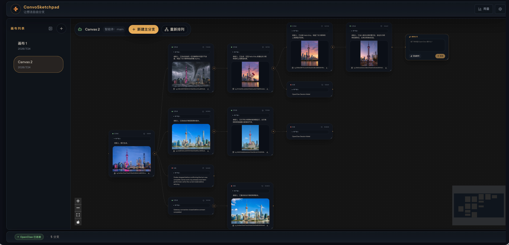

<div id="top" align="center">
  

# ConvoSketchpad

**让想法自由分支 · Let ideas fly free**

**Agent 可视化分支工作台——从任意节点回溯并继续探索**

**A visual branching workspace for agents — revisit any point and continue exploring.**

[](https://github.com/MrToyy/convosketchpad)
[](LICENSE)

[中文](#中文) · [English ↓](#english)
</div>

<p align="center">
  <a href="./public/screenshot.png">
    
  </a>
</p>

<a id="中文"></a>

## 中文

ConvoSketchpad 是 Agent 可视化分支工作台，让你从任意节点回溯并继续探索。它把 Agent 工作过程组织成可缩放的空间画布，让不同思路各自延伸，同时保持任务主线清晰。

> [!IMPORTANT]
> ConvoSketchpad **不是独立的 Agent 运行环境**，也不负责运行模型、工具或 Agent。它必须连接至少一个 Agent 运行端（Agent Runtime）。当前 v0.4.0 正式适配 [OpenClaw](https://github.com/openclaw/openclaw) Gateway 和本地 Codex App Server；Agent、工具调用、Conversation 和原始运行记录由运行端提供。

### 为什么做 ConvoSketchpad

Agent 运行端中的单个 Conversation 通常以线性消息流推进。在同一条对话中穿插创意试验、图片生成、临时调研或补充提问时，这些过程都会进入后续上下文，逐渐稀释主线目标；如果另开 Conversation，又需要重新组织分叉点之前的背景。

ConvoSketchpad 用可视化分支解决这个问题：你可以从任意已完成的交互创建新方向，带着当时的上下文独立试验，再继续真正值得推进的路径。提示词、回复、附件和生成结果都保留在各自的上下文链路中，探索过程不会挤乱主线。

### 适合谁

- **自媒体与内容创作者（优先推荐）**：围绕选题、叙事、文案和视觉风格并行尝试多个方向，在不同分支生成和比较图片，同时继续使用运行端中已经配置的 Agent、插件、技能与工具。
- **研究、产品及其他知识工作者**：让主线专注于目标任务，把临时调研、验证和补充询问放到侧支；得到答案后，再将筛选、整理过的结论带回主线，避免过程信息持续占用核心上下文。

### 核心能力

- 在一个可平移、缩放的 Canvas 中创建多个根分支。
- 以仅追加方式组织交互，明确区分“继续”和“分支”。
- 从任意已完成的交互携带当时上下文创建试验分支。
- setup 配置需要连接的 Agent 运行端，所有运行端提供的 Agent 平权进入统一目录。
- 新 Canvas 自动选择 setup 配置的可用默认 Agent，不可用时回退到第一个可用项；首次发送前可更换，发送预留创建后即锁定。
- 继续使用所选运行端已配置的 Agent、插件、技能与工具，无需维护第二套运行环境。
- 持久化保存用户附件和生成的 Artifact，并按用户隔离。
- 当运行端替换或移除分支 Conversation 时，通过规范快照恢复上下文。
- 在所属 Interaction 节点内处理 Agent 的审批请求，并对持久授权进行二次确认。
- 支持可选的受管用户登录、会话撤销、限流和 Canvas 隔离。
- 前端界面支持中文和英文，并默认使用中文。

```text
Canvas
├── 根分支 A：交互 1 ── 交互 2 ── 交互 3
│                           └────── 分支 B
└── 根分支 C：交互 4 ── 交互 5
```

### 运行关系

```text
React Canvas ── HTTP/SSE ── ConvoSketchpad 服务端 ── Agent Runtime Port
                              │                       ├─ OpenClaw Adapter ⇄ Gateway
                              │                       └─ Codex Adapter ⇄ 本地 App Server
                              └──────── SQLite + Artifact 存储
```

Agent 运行端负责 Agent 执行、工具、Conversation 和原始运行记录；ConvoSketchpad 负责 Canvas 拓扑与布局、发送预留、恢复元数据、用户隔离，以及附件和 Artifact 的持久化副本。具体协议和凭据由各 Adapter 封装，Canvas 通用层不依赖 OpenClaw、Codex 等原生方法名。

### 已适配的 Agent 运行端

- **OpenClaw Gateway**：v0.4.0 正式支持；当前验证基线为 OpenClaw `2026.6.8`。setup 尚未强制最低 OpenClaw 版本，更早版本不在 Release 兼容保证内。适配能力包括多 Agent Profile、Conversation、附件、Artifact、用量、连接状态和节点内审批。
- **Codex App Server**：v0.4.0 正式支持 Codex CLI `0.146.0` 及以上版本的本地受监督接入；提供一个共享宿主机账户的 Codex Agent、Thread 恢复、文本/图片输入、流式输出、图片与通用 Artifact、用量/额度和节点内审批。

以下是计划支持候选，不代表已经适配或承诺具体版本。排序以图片设计用途的直接性为准：原生图片生成/编辑优先于明确的设计工作流和多模态输入，仅能通过外部 MCP 扩展图片能力的候选排在后面。

| 顺序 | 候选 Runtime | 图片设计适用性 | 基本接入条件 |
|---:|---|---|---|
| 1 | [CodeBuddy Code](https://www.codebuddy.ai/docs/cli/cli-reference) | CLI [内置 `ImageGen`、`ImageEdit` 和 `VideoGen`](https://www.codebuddy.ai/docs/cli/tools-reference)，支持文生图、图生图和图片编辑，也能[处理多图片上下文](https://www.codebuddy.ai/docs/cli/common-workflows)，最贴近图片设计主流程 | 具备 ACP、REST API、Agent SDK、`stream-json` 和后台服务，结构化接入条件较完整 |
| 2 | [Qoder CLI](https://docs.qoder.com/en/cli/quick-start) | Qoder 提供面向海报、横幅和落地页的 [Design 工作台](https://docs.qoder.com/qoderwork/design)，CLI 的 [ACP 也明确支持图片](https://docs.qoder.com/en/cli/acp)；仍需确认设计产物能否通过 CLI/ACP 完整导出 | 具备 Agent SDK、ACP、流式消息、Session 和权限回调，结构化接入条件较完整 |
| 3 | [Kimi Code](https://www.kimi.com/code/docs/en/kimi-code-cli/reference/kimi-command.html) | 原生支持[图片和视频输入](https://www.kimi.com/code/docs/en/kimi-code-cli/guides/interaction)、媒体文件读取，并可通过 [MCP](https://www.kimi.com/code/docs/en/kimi-code-cli/customization/mcp.html) 接入图片生成与编辑工具 | 具备 ACP JSON-RPC，以及本地 REST 与 WebSocket API，结构化接入条件较完整 |
| 4 | [Claude Code](https://code.claude.com/docs/en/cli-usage) | 支持[在终端输入截图、UI Mockup 和 Figma 导出图](https://code.claude.com/docs/en/common-workflows)，并可通过 [MCP](https://code.claude.com/docs/en/agent-sdk/mcp) 调用图片生成或设计工具 | 具备 Agent SDK、`stream-json`、Session 恢复和权限回调，结构化接入条件较完整 |
| 5 | [OpenCode](https://dev.opencode.ai/docs/cli/) | 未发现官方内置图片生成或专用设计流程；可通过本地或远程 [MCP Server](https://opencode.ai/docs/mcp-servers/) 调用图片工具，因此作为扩展型候选保留 | 具备 ACP、无头 HTTP Server、Session 与导入导出接口，结构化接入条件较完整 |

新运行端必须优先通过 App Server、ACP、Gateway、SDK 或稳定的机器可解析无头模式接入，不解析终端 UI 或非稳定 stdout。图片能力还必须覆盖输入媒体、生成或编辑工具调用、二进制 Artifact 发现与持久化；正式实现仍以事件完整性、审批安全、Session 恢复和 Adapter 一致性测试为准。

### 环境要求

- macOS 或 Linux
- Node.js 22.22.2 或更高版本
- npm 和 Git
- 至少一个已配置且可访问的 Agent 运行端：OpenClaw Gateway，或已登录的本地 Codex CLI `0.146.0+`

### 快速安装

推荐使用安装脚本：

```bash
curl -fsSL https://raw.githubusercontent.com/MrToyy/convosketchpad/main/install.sh | bash
```

安装脚本默认解析最新的官方稳定 Release。开发版安装需要显式指定 `--branch main`。完整参数请参阅[安装文档](docs/INSTALL.md)。

手动安装：

```bash
git clone https://github.com/MrToyy/convosketchpad.git
cd convosketchpad
npm install
npm run setup
npm run build
npm start
```

`npm run setup` 会先探测并多选 Agent 运行端，再逐项配置连接，随后配置访问方式和可选的受管用户认证，最后从统一 Agent 目录选择新建 Canvas 的默认 Agent。Codex 接入直接监督本机 `codex app-server`；若未登录，setup 会提示运行 `codex login` 后重试，但不会代办 Runtime 登录或阻断其他配置。安装或启动本项目不会替代 Agent 运行端。

### 开发调试

```bash
npm install
npm run setup
npm run dev
```

`npm run dev` 会同时启动 Vite 客户端和监听模式服务端，只需打开终端中标记为 `Open in browser` 的地址：

- `HOST` 和 `PORT` 在开发、生产中都表示浏览器访问的 ConvoSketchpad 入口，默认是 `127.0.0.1:3080`。
- `/api` 和 `/health` 会由 Vite 代理到内部服务端；浏览器不连接 Gateway WebSocket。
- 内部服务端只绑定 loopback，端口由开发脚本自动选择，无需配置。
- React 客户端支持 HMR；服务端代码变更后由 `tsx watch` 自动重启。

自定义开发地址：

```bash
PORT=4000 npm run dev
```

此时浏览器入口是 `http://127.0.0.1:4000`。需要从 LAN 或 Tailscale 访问时，请重新运行 setup 选择对应访问模式，让 `HOST`、`ALLOWED_ORIGINS` 和认证策略保持一致。修改环境变量后需要重新启动开发进程。

### 常用命令

| 命令 | 用途 |
|---|---|
| `npm run dev` | 同时启动支持热更新的客户端和服务端 |
| `npm run setup` | 运行安装与连接配置向导 |
| `npm run build` | 构建生产版客户端、服务端和 CLI |
| `npm start` | 启动已构建的生产服务 |
| `npm run prod` | 构建并立即启动生产服务 |
| `npm run users -- <command>` | 管理受管用户 |
| `npm run update` | 更新已安装的 ConvoSketchpad |
| `npm test -- --run` | 运行一次完整测试 |
| `npm run lint` | 执行代码检查 |

### 核心配置

复制 `.env.example` 或运行 `npm run setup` 生成 `.env`。以下仅列出最常用的配置：

| 环境变量 | 默认值 | 用途 |
|---|---|---|
| `AGENT_RUNTIMES` | `openclaw` | 启用的 Agent 运行端，按顺序组成统一 Agent 目录 |
| `CONVOSKETCHPAD_DEFAULT_AGENT_RUNTIME` | 未设置 | 新建 Canvas 优先使用的 Agent 运行端 |
| `CONVOSKETCHPAD_DEFAULT_AGENT_PROFILE` | 未设置 | 新建 Canvas 优先使用的 Agent Profile；不可用时回退 |
| `OPENCLAW_GATEWAY_URL` | `http://127.0.0.1:18789` | OpenClaw Gateway 地址 |
| `OPENCLAW_GATEWAY_TOKEN` | 空 | 仅供服务端使用的 Gateway 共享 Token；本机 RPC、Gateway HTTP 与远程配对 bootstrap 使用 |
| `CODEX_BIN` | `codex` | Codex CLI 命令或绝对路径；最低且已验证版本为 `0.146.0` |
| `CODEX_WORKING_DIRECTORY` | `~/codex-convosketchpad` | Codex 可读写的项目目录；setup 按需创建，不是 `~/.codex` |
| `HOST` | `127.0.0.1` | 开发与生产统一的浏览器入口监听地址 |
| `PORT` | `3080` | 开发与生产统一的浏览器入口端口 |
| `CONVOSKETCHPAD_AUTH` | `false` | 是否启用受管用户认证 |
| `CONVOSKETCHPAD_DATA_DIR` | `~/.convosketchpad` | ConvoSketchpad 自有状态目录 |

对外提供服务前，请启用受管用户认证，并通过反向代理或 Tailscale Serve 提供 HTTPS；ConvoSketchpad 自身只监听 HTTP。请仔细配置精确 Origin、可信代理与网络访问策略。完整说明请参阅[配置文档](docs/CONFIGURATION.md)、[部署文档](docs/DEPLOYMENT.md)和[安全文档](docs/SECURITY.md)。

### 产品路线图

- **更多 Agent 运行端**：按上方图片设计适用性顺序验证候选；正式实现以媒体与 Artifact 传输、结构化协议完备度、安全审批、Session 恢复和 Adapter 一致性为准，不因排名绕过准入条件。
- **Windows 支持**：补齐 Windows 原生安装、setup、服务管理、路径与权限处理、Runtime 探测以及构建和自动化测试，使其达到与 macOS、Linux 一致的受支持状态。
- **`@图片` 与资源引用**：在输入中引用 Canvas 图片、附件和节点产物，并保留所有者、路径与运行端能力校验。
- **分支合并**：选择一个或多个分支生成新的 Interaction，保留来源和历史，不改写既有 Conversation。
- **后续方向**：运行端能力发现、Adapter 一致性测试、跨 Agent 交接、多 Agent 协作和更多多模态能力。

### 文档

产品与架构：

- [产品目标与原则](docs/PRODUCT.md)
- [架构、Session 与运行时数据流](docs/ARCHITECTURE.md)
- [Canvas 功能索引](docs/canvas/README.md)

安装与运维：

- [文档总索引](docs/README.md)
- [安装](docs/INSTALL.md)
- [部署](docs/DEPLOYMENT.md)
- [配置](docs/CONFIGURATION.md)
- [安全](docs/SECURITY.md)
- [故障排查](docs/TROUBLESHOOTING.md)
- [更新](docs/UPDATING.md)
- [HTTP API](docs/API.md)

维护者参考：

- [Canvas 功能与代码地图](docs/canvas/CANVAS-CODE-MAP.md)
- [认证功能与代码地图](docs/canvas/AUTH-CODE-MAP.md)
- [Git 工作流](docs/canvas/GIT-WORKFLOW.md)

### 许可证

本项目采用 [MIT License](LICENSE)。第三方来源与版权说明见
[NOTICE](NOTICE.md)。

<p align="right"><a href="#top">返回顶部 ↑</a> · <a href="#english">跳转到 English ↓</a></p>

---

<a id="english"></a>

## English

ConvoSketchpad is a visual branching workspace for agents: revisit any point and continue exploring. It organizes Agent work on a zoomable spatial Canvas, so different ideas can develop independently while the primary task stays focused.

> [!IMPORTANT]
> ConvoSketchpad is **not a standalone Agent runtime** and does not run models, tools, or Agents by itself. It must connect to at least one Agent Runtime. v0.4.0 officially supports the [OpenClaw](https://github.com/openclaw/openclaw) Gateway and a local Codex App Server; the Runtime provides Agents, tool execution, Conversations, and authoritative run records.

> [!NOTE]
> Most detailed project documentation is written in Chinese. English-speaking developers are encouraged to use a capable large language model to translate and explain the documents while preserving code identifiers, commands, environment variables, and OpenClaw protocol names.

### Why ConvoSketchpad exists

An Agent Runtime Conversation usually advances as a linear message stream. When creative experiments, image generation, quick research, and side questions all happen in one chat, they become part of the context for everything that follows and gradually dilute the primary objective. Starting a separate Conversation avoids that mixture, but requires reconstructing the context that existed at the fork point.

ConvoSketchpad turns that trade-off into a visual branching workflow. Fork any completed Interaction with its context, explore independently, and continue only the paths worth pursuing. Prompts, responses, attachments, and generated results remain organized in their respective context chains instead of crowding the main line.

### Who it is for

- **Social media and content creators (recommended first)**: explore topics, narratives, copy, and visual styles in parallel; generate and compare images across branches; and keep using the Agents, plugins, skills, and tools already configured in the selected Runtime.
- **Researchers, product teams, and other knowledge workers**: keep the primary branch centered on the target task, move temporary research, validation, and side questions into branches, then summarize selected findings back into the main line.

### Core capabilities

- Create multiple root branches on one pan-and-zoom Canvas.
- Organize append-only Interactions with explicit Continue and Fork semantics.
- Fork any completed Interaction with its context for independent experiments.
- Configure Agent Runtimes during setup and use all discovered Agents through one equal, unified catalog.
- Select the configured default Agent for a new Canvas, fall back to the first available Agent, allow changes before the first send, and lock it when a send reservation is created.
- Keep using the Agents, plugins, skills, and tools configured in the selected Runtime without maintaining a second execution environment.
- Keep durable, owner-scoped copies of user attachments and generated Artifacts.
- Recover context from canonical snapshots when a Runtime replaces or removes a Branch Conversation.
- Resolve Agent approval requests inside their Interaction nodes, with confirmation for persistent grants.
- Optionally enable managed-user login, session revocation, rate limiting, and Canvas isolation.
- Use the frontend in Chinese or English, with Chinese as the default.

```text
Canvas
├── Root A: Interaction 1 ── Interaction 2 ── Interaction 3
│                                  └────────── Fork B
└── Root C: Interaction 4 ── Interaction 5
```

### Runtime relationship

```text
React Canvas ── HTTP/SSE ── ConvoSketchpad server ── Agent Runtime Port
                              │                       ├─ OpenClaw Adapter ⇄ Gateway
                              │                       └─ Codex Adapter ⇄ local App Server
                              └──────── SQLite + Artifact store
```

Agent Runtimes own Agent execution, tools, Conversations, and authoritative run records. ConvoSketchpad owns Canvas topology and layout, send reservations, recovery metadata, user isolation, and durable copies of attachments and Artifacts. Each Adapter contains its native protocol and credentials; shared Canvas code does not depend on OpenClaw, Codex, or other native method names.

### Supported Agent Runtimes

- **OpenClaw Gateway**: officially supported in v0.4.0, with OpenClaw `2026.6.8` as the current validated baseline. Setup does not yet enforce a minimum OpenClaw version, so earlier versions are outside the Release compatibility guarantee. The integration includes multiple Agent Profiles, Conversations, attachments, Artifacts, usage, connection health, and in-node approvals.
- **Codex App Server**: officially supported in v0.4.0 through a supervised local Codex CLI `0.146.0` or newer, including one shared-host-account Agent, Thread resume, text/image input, streaming output, image and general Artifacts, usage/quotas, and in-node approvals.

The following are planned-support candidates, not completed integrations or release commitments. They are ordered by how directly they fit image-design work: native image generation and editing rank ahead of explicit design workflows and multimodal input, while candidates that depend entirely on external MCP tools rank lower.

| Order | Candidate Runtime | Image-design fit | Basic integration surface |
|---:|---|---|---|
| 1 | [CodeBuddy Code](https://www.codebuddy.ai/docs/cli/cli-reference) | Its CLI has built-in [`ImageGen`, `ImageEdit`, and `VideoGen`](https://www.codebuddy.ai/docs/cli/tools-reference) for text-to-image, image-to-image, and image editing, and can [work with multiple images](https://www.codebuddy.ai/docs/cli/common-workflows); this is the closest fit for the core image-design flow | ACP, REST API, Agent SDK, `stream-json`, and a background service provide a comparatively complete structured surface |
| 2 | [Qoder CLI](https://docs.qoder.com/en/cli/quick-start) | Qoder offers a [Design workbench](https://docs.qoder.com/qoderwork/design) for posters, banners, and landing pages, while its CLI [ACP explicitly supports images](https://docs.qoder.com/en/cli/acp); complete design-output export through CLI/ACP still requires validation | Agent SDK, ACP, streamed messages, Sessions, and permission callbacks provide a comparatively complete structured surface |
| 3 | [Kimi Code](https://www.kimi.com/code/docs/en/kimi-code-cli/reference/kimi-command.html) | Native [image and video input](https://www.kimi.com/code/docs/en/kimi-code-cli/guides/interaction), media-file reading, and [MCP access](https://www.kimi.com/code/docs/en/kimi-code-cli/customization/mcp.html) make it suitable for image-generation and editing tools | ACP JSON-RPC plus local REST and WebSocket APIs provide a comparatively complete structured surface |
| 4 | [Claude Code](https://code.claude.com/docs/en/cli-usage) | Accepts [screenshots, UI mockups, and Figma exports in the terminal](https://code.claude.com/docs/en/common-workflows) and can invoke image-generation or design tools through [MCP](https://code.claude.com/docs/en/agent-sdk/mcp) | Agent SDK, `stream-json`, Session resume, and permission callbacks provide a comparatively complete structured surface |
| 5 | [OpenCode](https://dev.opencode.ai/docs/cli/) | No official built-in image generator or dedicated design workflow was found; local or remote [MCP servers](https://opencode.ai/docs/mcp-servers/) can supply image tools, so it remains an extensibility-first candidate | ACP, headless HTTP server, Sessions, and import/export APIs provide a comparatively complete structured surface |

New Runtimes must prefer App Server, ACP, Gateway, SDK, or a stable machine-readable headless mode instead of parsing terminal UI or unstable stdout. Image support must also cover media input, generation or editing tool calls, and binary-Artifact discovery and persistence; implementation still depends on event completeness, approval safety, Session recovery, and Adapter conformance tests.

### Requirements

- macOS or Linux
- Node.js 22.22.2 or newer
- npm and Git
- At least one configured and reachable Agent Runtime: OpenClaw Gateway or a logged-in local Codex CLI `0.146.0+`

### Quick install

The install script is recommended:

```bash
curl -fsSL https://raw.githubusercontent.com/MrToyy/convosketchpad/main/install.sh | bash
```

By default, the installer resolves the latest official stable Release. Use `--branch main` explicitly for a development install. See the [installation guide](docs/INSTALL.md) for all options.

Manual install:

```bash
git clone https://github.com/MrToyy/convosketchpad.git
cd convosketchpad
npm install
npm run setup
npm run build
npm start
```

`npm run setup` first detects and lets you select Agent Runtimes, configures each connection, then configures access mode and optional managed-user authentication. Finally, it chooses the default Agent for new canvases from the unified catalog. Codex integration supervises the local `codex app-server`; when Codex is logged out, setup asks you to run `codex login` and retry without taking over Runtime login or blocking unrelated configuration.

### Development

```bash
npm install
npm run setup
npm run dev
```

`npm run dev` starts the Vite client and watch-mode server together. Open only the URL labeled `Open in browser` in the terminal:

- `HOST` and `PORT` identify the browser-facing ConvoSketchpad entrypoint in both development and production; the default is `127.0.0.1:3080`.
- Vite proxies `/api` and `/health` to the internal server; the browser never connects to the Gateway WebSocket.
- The internal server listens on loopback at an automatically selected port and requires no user configuration.
- The React client supports HMR; `tsx watch` restarts the server after server-side code changes.

To customize the development address:

```bash
PORT=4000 npm run dev
```

The browser entrypoint is then `http://127.0.0.1:4000`. For LAN or Tailscale access, rerun setup and select the matching access mode so `HOST`, `ALLOWED_ORIGINS`, and authentication policy stay aligned. Restart the development process after changing environment variables.

### Common commands

| Command | Purpose |
|---|---|
| `npm run dev` | Start the hot-reloading client and server together |
| `npm run setup` | Run the installation and connection setup wizard |
| `npm run build` | Build the production client, server, and CLI |
| `npm start` | Start an existing production build |
| `npm run prod` | Build and immediately start the production service |
| `npm run users -- <command>` | Manage local managed users |
| `npm run update` | Update an installed ConvoSketchpad |
| `npm test -- --run` | Run the full test suite once |
| `npm run lint` | Run code checks |

### Core configuration

Copy `.env.example` or run `npm run setup` to generate `.env`. The most commonly used settings are:

| Environment variable | Default | Purpose |
|---|---|---|
| `AGENT_RUNTIMES` | `openclaw` | Enabled Agent Runtimes in unified Agent catalog order |
| `CONVOSKETCHPAD_DEFAULT_AGENT_RUNTIME` | unset | Preferred Agent Runtime for a new Canvas |
| `CONVOSKETCHPAD_DEFAULT_AGENT_PROFILE` | unset | Preferred Agent profile for a new Canvas; falls back when unavailable |
| `OPENCLAW_GATEWAY_URL` | `http://127.0.0.1:18789` | OpenClaw Gateway address |
| `OPENCLAW_GATEWAY_TOKEN` | empty | Server-only shared Gateway token for local RPC, Gateway HTTP, and remote pairing bootstrap |
| `CODEX_BIN` | `codex` | Codex CLI command or absolute path; minimum and tested version is `0.146.0` |
| `CODEX_WORKING_DIRECTORY` | `~/codex-convosketchpad` | Project directory Codex may modify; setup creates it as needed, distinct from `~/.codex` |
| `HOST` | `127.0.0.1` | Unified development and production browser-entry bind address |
| `PORT` | `3080` | Unified development and production browser-entry port |
| `CONVOSKETCHPAD_AUTH` | `false` | Enable managed-user authentication |
| `CONVOSKETCHPAD_DATA_DIR` | `~/.convosketchpad` | ConvoSketchpad-owned state directory |

Before exposing the service to a network, enable managed-user authentication and terminate HTTPS at a reverse proxy or Tailscale Serve; ConvoSketchpad itself listens on HTTP only. Configure exact origins, trusted proxies, and network policy carefully. See [Configuration](docs/CONFIGURATION.md), [Deployment](docs/DEPLOYMENT.md), and [Security](docs/SECURITY.md).

### Product roadmap

- **More Agent Runtimes**: validate candidates in the image-design order above; implementation still depends on protocol completeness, media and Artifact transport, safe approvals, Session recovery, and Adapter conformance rather than rank alone.
- **Windows support**: add native Windows installation, setup, service management, path and permission handling, Runtime detection, builds, and automated tests to reach the same supported status as macOS and Linux.
- **`@image` and resource references**: reference Canvas images, attachments, and node outputs while preserving ownership, path, and Runtime-capability checks.
- **Branch merging**: create a new Interaction from selected branches while preserving provenance and history instead of rewriting existing Conversations.
- **Later directions**: Runtime capability discovery, Adapter conformance tests, cross-Agent handoff, multi-Agent collaboration, and broader multimodal support.

### Documentation

Product and architecture:

- [Product goals and principles](docs/PRODUCT.md)
- [Architecture, Sessions, and runtime data flow](docs/ARCHITECTURE.md)
- [Canvas feature index](docs/canvas/README.md)

Installation and operations:

- [Documentation index](docs/README.md)
- [Installation](docs/INSTALL.md)
- [Deployment](docs/DEPLOYMENT.md)
- [Configuration](docs/CONFIGURATION.md)
- [Security](docs/SECURITY.md)
- [Troubleshooting](docs/TROUBLESHOOTING.md)
- [Updating](docs/UPDATING.md)
- [HTTP API](docs/API.md)

Maintainer references:

- [Canvas feature and code map](docs/canvas/CANVAS-CODE-MAP.md)
- [Authentication feature and code map](docs/canvas/AUTH-CODE-MAP.md)
- [Git workflow](docs/canvas/GIT-WORKFLOW.md)

### License

This project is available under the [MIT License](LICENSE). See
[NOTICE](NOTICE.md) for third-party provenance and copyright notices.

<p align="right"><a href="#top">Back to top ↑</a> · <a href="#中文">中文 ↑</a></p>
